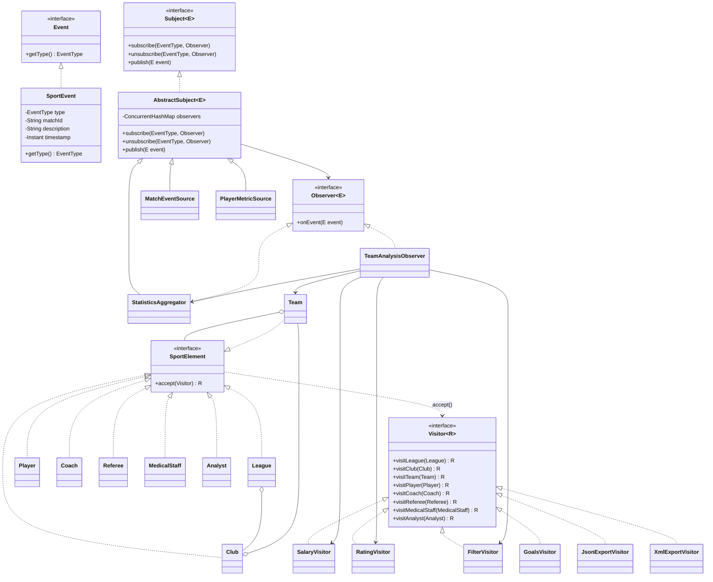

# UML Class Diagram — Live Sports System

```mermaid
classDiagram
    direction TB

    class Event {
        <<interface>>
        +getType() EventType
    }

    class SportEvent {
        -EventType type
        -String matchId
        -String description
        -Instant timestamp
        +getType() EventType
    }

    Event <|.. SportEvent

    class Observer~E~ {
        <<interface>>
        +onEvent(E event)
    }

    class Subject~E~ {
        <<interface>>
        +subscribe(EventType, Observer)
        +unsubscribe(EventType, Observer)
        +publish(E event)
    }

    class AbstractSubject~E~ {
        -ConcurrentHashMap observers
        +subscribe(EventType, Observer)
        +unsubscribe(EventType, Observer)
        +publish(E event)
    }

    class MatchEventSource
    class PlayerMetricSource
    class StatisticsAggregator
    class TeamAnalysisObserver

    Subject <|.. AbstractSubject
    AbstractSubject <|-- MatchEventSource
    AbstractSubject <|-- PlayerMetricSource
    AbstractSubject <|-- StatisticsAggregator

    Observer <|.. StatisticsAggregator
    Observer <|.. TeamAnalysisObserver
    AbstractSubject --> Observer

    class SportElement {
        <<interface>>
        +accept(Visitor) R
    }

    class League
    class Club
    class Team
    class Player
    class Coach
    class Referee
    class MedicalStaff
    class Analyst

    SportElement <|.. League
    SportElement <|.. Club
    SportElement <|.. Team
    SportElement <|.. Player
    SportElement <|.. Coach
    SportElement <|.. Referee
    SportElement <|.. MedicalStaff
    SportElement <|.. Analyst

    League o-- Club
    Club o-- Team
    Team o-- SportElement

    class Visitor~R~ {
        <<interface>>
        +visitLeague(League) R
        +visitClub(Club) R
        +visitTeam(Team) R
        +visitPlayer(Player) R
        +visitCoach(Coach) R
        +visitReferee(Referee) R
        +visitMedicalStaff(MedicalStaff) R
        +visitAnalyst(Analyst) R
    }

    class SalaryVisitor
    class RatingVisitor
    class FilterVisitor
    class GoalsVisitor
    class JsonExportVisitor
    class XmlExportVisitor

    Visitor <|.. SalaryVisitor
    Visitor <|.. RatingVisitor
    Visitor <|.. FilterVisitor
    Visitor <|.. GoalsVisitor
    Visitor <|.. JsonExportVisitor
    Visitor <|.. XmlExportVisitor

    SportElement ..> Visitor : accept()

    TeamAnalysisObserver --> Team
    TeamAnalysisObserver --> SalaryVisitor
    TeamAnalysisObserver --> RatingVisitor
    TeamAnalysisObserver --> FilterVisitor
    TeamAnalysisObserver --> StatisticsAggregator
```